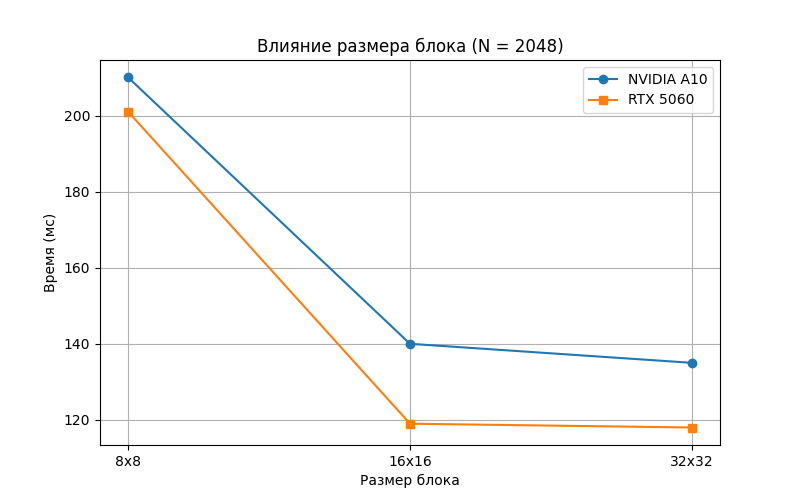
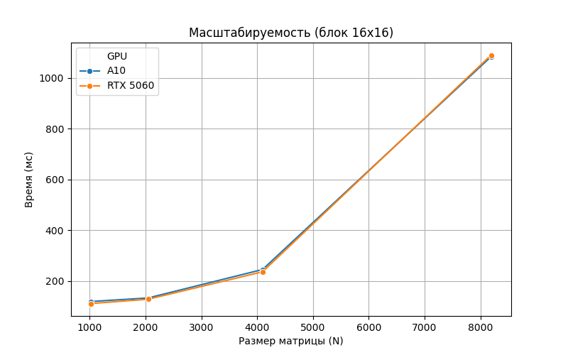

# Лабораторная работа № 4
# Выполнил студент группы 6214 Пикалов Никита Олегович

#### Изменения
Добавил cuda файл для вычислений на видеокарте и сделал тесты на NVIDIA 5060 и NVIDIA A10
Перенос вычислений на GPU оправдан для задач с высокой степенью параллелизма, таких как матричное умножение. 
Использование CUDA позволяет задействовать тысячи потоковых процессоров одновременно, 
что дает многократное преимущество перед CPU-версией на больших объемах данных.

# Измерения представлены в таблице
Инфраструктура: 
Узел 1: NVIDIA A10 (24 GB VRAM, Ampere) 
Узел 2: NVIDIA GeForce RTX 5060 (8 GB VRAM, Blackwell) 
Таблица 1. Влияние размера блока (при N = 2048) 

| Конфиг блока | Время A10 (мс) | Время 5060 (мс) | 
|--------------|----------------|-----------------|
| 8 x 8 | 210 | 201 | 
| 16 x 16 | 140 | 119 | 
| 32 x 32 | 135 | 118 | 

Таблица 2. Масштабируемость (блок 16 x 16) 

| Размер (N) | Время A10 (мс) | Время 5060 (мс) | 
|--------------|----------------|-----------------|
| 1024 | 119 | 111 | 
| 2048 | 133 | 128 | 
| 4096 | 245 | 236 | 
| 8192 | 1084 | 1090 | 

# Выводы

Эксперименты показали, что размер блока 16x16 и 32x32 является более эффективным, чем 8x8. 
Это связано с тем, что маленькие блоки не позволяют полностью загрузить "варпы" (группы по 32 потока) 
и снижают эффективность использования кэша L1. 
При малых размерах матриц (1024-2048) время выполнения практически не меняется (около 110-140 мс). 
Это объясняется тем, что основное время занимает не само вычисление, а копирование данных из оперативной
памяти в видеопамять и обратно по шине PCIe.
На больших матрицах (8192) GPU демонстрирует колоссальное превосходство над CPU. Время выполнения ~1 сек для 8192x8192 соответствует вычислительной мощности, недоступной традиционным многоядерным процессорам.
Профессиональная карта A10 и потребительская RTX 5060 показали схожие результаты на данных объемах, так как задача 
ограничена пропускной способностью памяти и шины обмена данными, а не чистой вычислительной мощностью ядер. 
