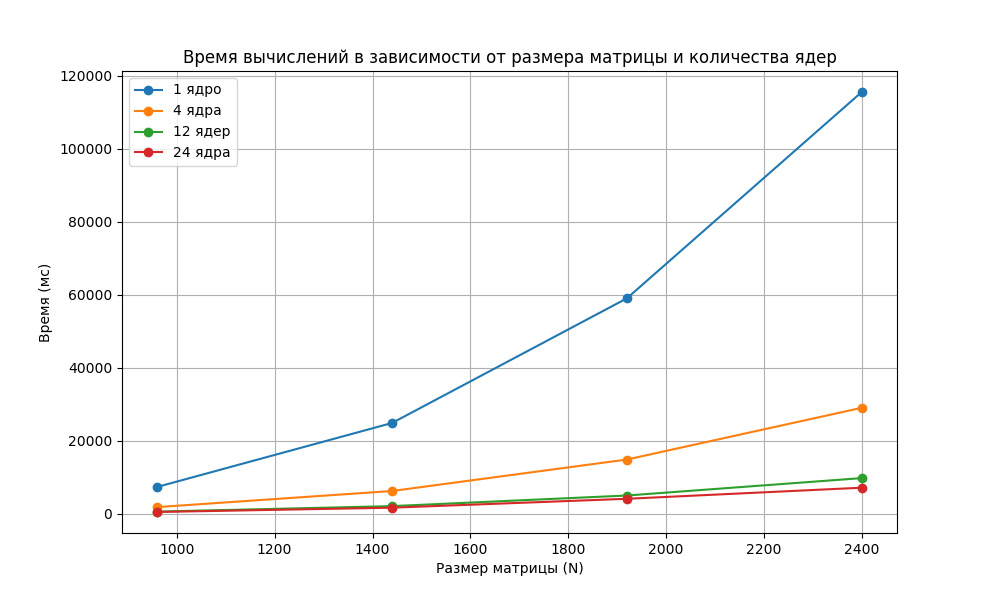
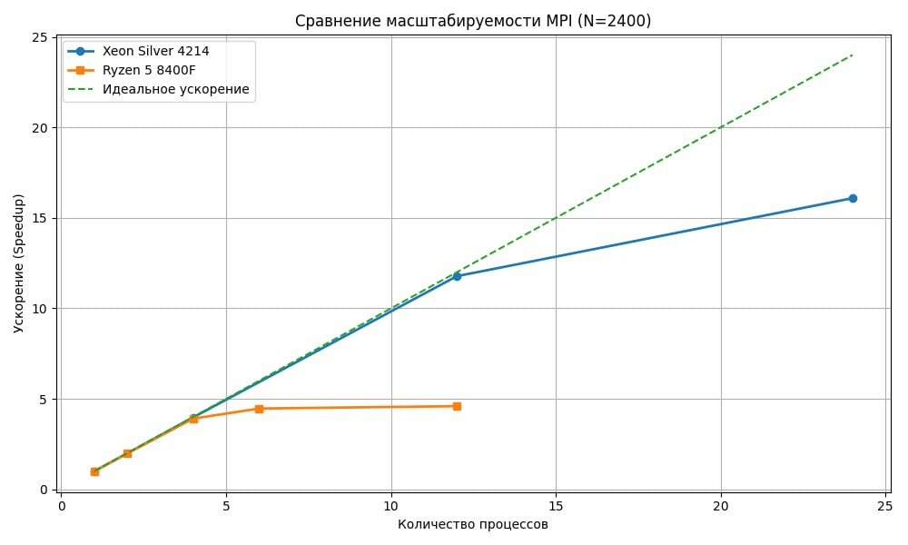

# Лабораторная работа № 5
# Выполнил студент группы 6214 Пикалов Никита Олегович

# Xeon Silver 4214
## Измерения представлены в таблице 

| Размер (N)   | 1 ядро (мс)  | 4 ядра (мс)   | 12 ядер (мс)   | 24 ядра (мс)   |
|--------------|--------------|---------------|----------------|----------------|
| 960          | 7 396        | 1 865         | 637            | 527            |
| 1440         | 24 912       | 6 278         | 2 137          | 1 712          |
| 1920         | 59 058       | 14 901        | 5 043          | 4 145          |
| 2400         | 115 567      | 29 070        | 9 812          | 7 184          |
|--------------|--------------|---------------|----------------|----------------|
| Статус Verif | SUCCESS      | SUCCESS       | SUCCESS        | SUCCESS        |

## Анализ ускорения и эффективности (на примере N=2400)

Расчет ускорения (S = T1 / Tn) и эффективности (E = S / n * 100%):

| Ядра (n) | Время (мс) | Ускорение  | Эффективность |
|----------|------------|------------|---------------|
| 1        | 115 567    | 1.00x      | 100.0%        |
| 4        | 29 070     | 3.98x      | 99.5%         |
| 12       | 9 812      | 11.78x     | 98.2%         |
| 24       | 7 184      | 16.08x     | 67.0%         |

# Ryzen 5 8400F

## Измерения представлены в таблице

| Размер (N)   | 1 ядро (мс)  | 2 ядра (мс)  | 4 ядра (мс)  | 6 ядер (мс)  | 12 ядер (мс)  |
| ------------ | ------------ | ------------ | ------------ | ------------ | ------------- |
| 200          | 34           | 17           | 9            | 11           | 10            |
| 400          | 272          | 138          | 70           | 93           | 71            |
| 800          | 2180         | 1094         | 557          | 572          | 434           |
| 1200         | 7297         | 3700         | 1892         | 2504         | 1480          |
| 1600         | 17314        | 8855         | 4453         | 5918         | 3457          |
| 2000         | 33783        | 17045        | 8665         | 8776         | 6902          |
| 2400         | 58445        | 29487        | 14956        | 13091        | 12714         |
| ------------ | ------------ | ------------ | ------------ | ------------ | ------------- |
| Статус Verif | SUCCESS      | SUCCESS      | SUCCESS      | PARTIAL      | PARTIAL       |

SUCCESS — все замеры корректны
PARTIAL — часть запусков некорректна (из-за делимости N на P)

# Анализ

## Xeon

На процессоре Intel Xeon Silver 4214 наблюдается близкое к линейному ускорение до 12 физических ядер. 
Однако при дальнейшем увеличении числа потоков эффективность снижается. Это связано с накладными расходами на межпроцессорное взаимодействие, 
включая передачу данных через системную шину и синхронизацию процессов.

При использовании 24 потоков (Hyper-Threading) вычислительные ресурсы физических ядер разделяются между потоками, 
что приводит к снижению эффективности до ~67%.

## Ryzen

На процессоре AMD Ryzen 5 8400F максимальная эффективность достигается уже при 4–6 процессах. 
Дальнейшее увеличение числа потоков приводит к незначительному росту производительности.

Это объясняется ограничениями пропускной способности памяти и конкуренцией за кэш-память, 
а также ростом накладных расходов MPI.

# Выводы

Основным фактором, ограничивающим масштабируемость на обоих процессорах, 
являются затраты на передачу данных между процессами через системную шину и память.

При увеличении числа процессов возрастает объём коммуникаций между ними, 
что снижает эффективность параллельного выполнения.

